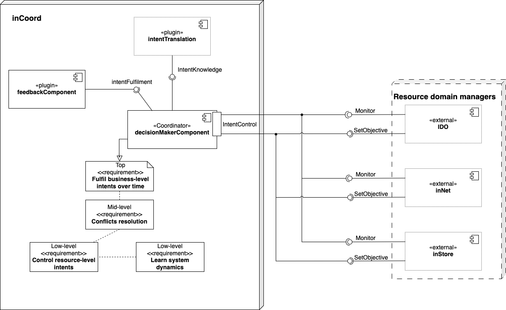
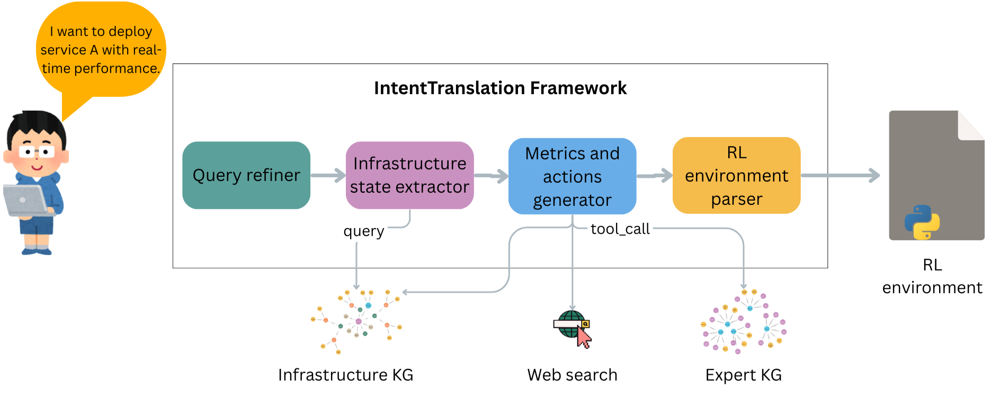

# inCoord
Here, we display the architecture for inCoord. The goal is to build a flexible and self-adaptive solution for coordinating multi-domain infrastructure instances, based on intents. In complex and hierarchical systems, such as the computing continuum, switching from “how” to “what” is essential. Our key idea is to achieve that by only controlling the instance-level intents. We tune these intents, as knobs, to fulfill the application-level intent and handle conflicts across infrastructure domains. This approach makes the solution flexible and independent of intents and infrastructures, as it automatically triggers strategy adaptations for the involved instance managers. 

To have a clear overview of the inCoord role in a multi-domain computing infrastructure, we can analyze the main components depicted in Figure above. 

inCoord operates based on high-level instructions translated and decomposed into actionable intents. This set contains at least one application-level intent that reflects the objective for the target application, and at least one instance-level intent for each domain instance. A dedicated component, intentTranslation, performs this translation through an external tool or an internal plugin in inCoord.  

To test our solution, we implemented a dedicated “Intent-to-Learning” plugin that, through a multi-agent system built on Large Language Models (LLMs), translates application-level intents into executable Reinforcement Learning (RL) environments. The Figure above shows the overall behavior.

The _intentFulfillment_ component holds the procedure, whether it is a rule or a more complex structure, such as an RL reward function, to evaluate whether the coordination successfully fulfills the application-level intent. This feedback can be produced by an external tool during the intent translation phase or manually constructed by a domain expert. Again, structuring it as a plugin leaves it open to adapting to every use case. 

In fact, at runtime, inCoord relies on telemetry from the infrastructure manager instances and application, continuously evaluating each in compliance with the defined instance-level and application-level intents, respectively. This information facilitates real-time decision-making.  

The decisionMakerComponent is the inCoord core element, as it holds the strategy's logic. By learning the system's dynamics, this component decides at runtime whether to adjust the intent for each instance. The update actions consist of forwarding the new instance-level intents to each domain manager instance so that, in turn, they can make low-level decisions on the infrastructure. These recurrent adjustments have two main effects. The first one is to tailor the instance-level intents to the real requirements of the application. Even if carefully defined through some expert knowledge or application profiling, it is still possible that the intents might be different. For example, the computing demand might be relaxed, allowing the application owner to save on infrastructure costs. The second important aspect is resolving conflicts in a multi-domain, possibly multi-provider infrastructure, where conditions can change at runtime.  

 We envision inCoord interoperability through the definition of APIs. The API enables requirements “Ingestion, i.e., where intent-translation tools can submit both application- and instance-level intents; furthermore, inCoord offers reporting, where it shares current choices and metrics. Event-driven notifications could allow inCoord to receive real-time updates, e.g., violations, following a subscription model. For example, the framework proposed by TM Forum enables the reception of reports associated with the intents. 