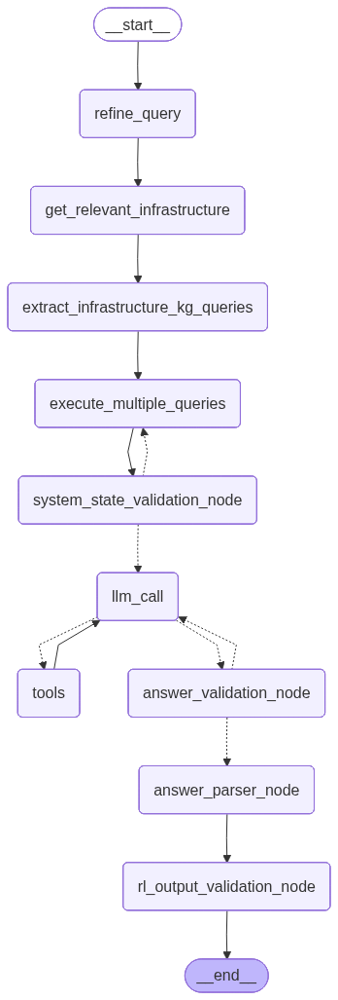

# Intent Translation for Cloud Continuum Management

This repository implements a framework for **Intent Translation** in multi-domain cloud continuum management.  
It enables the translation of **high-level business intents** (e.g., “ensure real-time video analytics within budget”) into **low-level, actionable metrics** that can be used to configure cloud infrastructure (network, compute, and storage).  

The system leverages **Knowledge Graphs (KGs)**, **LLM-based agents**, and **Reinforcement Learning (RL)** to generate environments where intents are mapped into metrics, observation spaces, and reward functions.  
It blends Tavily-powered web search with GraphRAG queries over Neo4j knowledge graphs to refine questions and synthesize answers.

## What it does
- Hybrid retrieval: web search (Tavily) + GraphRAG over **Infrastructure** and **Expert** knowledge graphs (Neo4j).
- Query refinement with an LLM (`gpt-4o-mini`) and decision nodes implemented with **LangGraph**.
- Generation of RL environment for intent fulfillment.
- Validation passes: system state checks, answer parsing, and RL-style output validation nodes.
- Modular tool nodes so you can swap search and KG backends.

## File layout
- `main.ipynb` — the end-to-end research pipeline.
- `prompts/` — prompts helpers referenced by the notebook.
- `.env` — environment variables (see below).

## Key functions
| Function | Purpose                                                                                                       |
|---|---------------------------------------------------------------------------------------------------------------|
| `refine_query` | Refine the user query.                                                                                        |
| `get_relevant_infrastructure` | Using the infrastructure KG schema decides on nodes and relationships relevant for the problem                |
| `extract_infrastructure_kg_queries` | Using the infrastructure KG extraction guidelines generates queries for the KG                                |
| `execute_multiple_queries` | Execute multiple queries on the KG and get the results.                                                       |
| `system_state_validation_node` | Validates the extracted from the Infrastructure KG system state                                               |
| `llm_call` | ReAct agent, capable of deciding whether and how to call a tool or to generate an answer for the given intent |
| `tool_node` | Perform the tool calls.                                                                                       |
| `answer_validation_node` | Validate the answer.                                                                                          |
| `answer_parser_node` | Creates an RL environment                                                                                     |
| `rl_output_validation_node` | Validates the RLenvironment.                                                                                  |
| `graphrag_expert_search` | Performs a query on an Expert Knowledge Graph (GraphRAG).                                                     |
| `graphrag_infrastructure_search` | Performs a query on an Infrastructure Knowledge Graph (GraphRAG).                                             |
| `web_search` | Performs a web search using the Tavily API.                                                                   |
| `write_result` | Writes the final state to files.                                                                              |


## Setup

### 1) Create and fill a `.env`
```
# LLM & tracing
OPENAI_API_KEY=...
LANGSMITH_TRACING=true            # optional
LANGSMITH_PROJECT=abstract/run0   # optional
LANGSMITH_ENDPOINT=https://api.smith.langchain.com  # optional

# Search
TAVILY_API_KEY=...

# Neo4j (GraphRAG backends)
NEO4J_URI=bolt://localhost:7687
NEO4J_USERNAME=neo4j
NEO4J_PASSWORD=your_password
```

### 2) Install dependencies
```bash
pip install python>=3.10 langchain-community langchain-core langchain-openai langgraph langchain-neo4j tavily-python python-dotenv networkx graphviz matplotlib json-repair
```

### 3) Run the notebook
Open `main.ipynb` in Jupyter or VS Code and execute cells top-to-bottom. The graph queries expect a running Neo4j with the Infrastructure and Expert KGs loaded and indexed.
You can use the provided `infrastructure_kg.cypher` and `expert_kg.cypher` files to create the graphs.

## Usage tips
- If Neo4j isn’t available, you can still run the translation framework by setting `hasKG = False` in the notebook.
- You can adjust the model (e.g., `gpt-4o-mini`) or the `temperature` parameter in the `ChatOpenAI` call to fine-tune performance.
- To change the users' intent, modify the `human_query` variable in the notebook. 
- Customize the prompts in the `prompts` file to better fit your domain or use case.
- ️ Use **LangSmith** to trace, debug, and evaluate your translation workflows, making it easier to monitor, optimize, and improve performance.
 

## Workflow Diagram

[//]: # (![Workflow Diagram]&#40;./workflow_graph.png&#41;)



